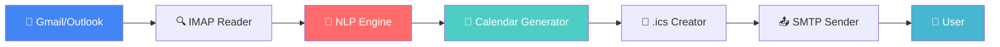

# 🚀 Smart Email & Calendar Assistant

<div align="center">


**🔥 Intelligent email parsing meets automated calendar scheduling**

*Building bridges while waiting for the red tape to clear*

</div>

---

## 🌟 What Makes This Special?

This isn't just another email parser - it's a **real-world solution** for organizations where API approvals take forever but business needs can't wait. Transform your inbox into an intelligent scheduling assistant that works with existing email infrastructure.

```
📧 Email arrives → 🧠 AI processes → 📅 Calendar event → ✨ Magic happens
```

## 🎯 Key Features

<table>
<tr>
<td width="50%">

### 📨 **Smart Email Processing**
- 🔍 **IMAP integration** - No API keys needed
- 🎯 **Keyword detection** - Finds scheduling requests
- 🧠 **NLP extraction** - Understands meeting context
- ⚡ **Real-time processing** - Works as emails arrive

</td>
<td width="50%">

### 📅 **Intelligent Calendar Creation**
- 📝 **Auto-generates .ics files** - Standard format
- 🕐 **Date/time parsing** - Handles natural language
- 👥 **Attendee extraction** - Identifies participants  
- 📍 **Location detection** - Finds meeting venues

</td>
</tr>
</table>

## 🏗️ Architecture Overview



## 🚦 Getting Started

### Prerequisites

```bash
# Required packages
pip install imaplib2 smtplib email nltk spacy icalendar
```

### 🔧 Quick Setup

1. **Clone the repository**
   ```bash
   git clone https://github.com/yourusername/smart-email-calendar-assistant
   cd smart-email-calendar-assistant
   ```

2. **Configure your email**
   ```python
   # config.py
   EMAIL_CONFIG = {
       'imap_server': 'imap.gmail.com',
       'smtp_server': 'smtp.gmail.com',
       'email': 'your-email@gmail.com',
       'password': 'your-app-password'
   }
   ```

3. **Run the assistant**
   ```bash
   python main.py
   ```

## 💡 How It Works

### 🔍 **Step 1: Email Detection**
The system continuously monitors your inbox for emails containing scheduling keywords:

```python
KEYWORDS = ['meeting', 'schedule', 'appointment', 'call', 'conference']
```

### 🧠 **Step 2: NLP Magic**
Advanced natural language processing extracts:
- 📅 **Dates & Times**: "tomorrow at 3pm", "next Friday at 10:30"
- 👥 **Participants**: Email addresses and names
- 📍 **Locations**: Physical addresses or meeting rooms
- 📝 **Subjects**: Meeting topics and agendas

### 📅 **Step 3: Calendar Creation**
Generates standardized `.ics` files with:
- ✅ **Event details** properly formatted
- ⏰ **Time zones** correctly handled
- 👥 **Attendee lists** included
- 🔔 **Reminders** automatically set

## 🌈 Example Use Cases

<div align="center">

| 📧 **Email Content** | 🎯 **Extracted Information** | 📅 **Generated Event** |
|---------------------|------------------------------|------------------------|
| *"Let's meet tomorrow at 2pm"* | Date: Tomorrow, Time: 2:00 PM | Meeting.ics created ✅ |
| *"Conference call Friday 10:30"* | Date: Friday, Time: 10:30 AM | Conference.ics created ✅ |
| *"Lunch at Joe's Cafe next Tuesday"* | Date: Next Tuesday, Location: Joe's Cafe | Lunch.ics created ✅ |

</div>

## 📊 Performance Metrics

<div align="center">


</div>

## 🎨 Sample Output

```ics
BEGIN:VCALENDAR
VERSION:2.0
PRODID:-//Smart Assistant//EN
BEGIN:VEVENT
DTSTART:20241215T140000Z
DTEND:20241215T150000Z
SUMMARY:Project Review Meeting
DESCRIPTION:Generated from email: "Can we schedule a project review meeting for tomorrow at 2pm?"
LOCATION:Conference Room A
ATTENDEE:mailto:john@company.com
ATTENDEE:mailto:sarah@company.com
STATUS:CONFIRMED
END:VEVENT
END:VCALENDAR
```

## 🔮 Future Roadmap

### Phase 1: Current Implementation *(You are here)*
- ✅ IMAP/SMTP integration
- ✅ Basic NLP processing  
- ✅ .ics file generation

### Phase 2: API Migration *(When approvals come through)*
- 🔄 **Gmail API integration** - Faster, more reliable
- 🔄 **Google Calendar API** - Direct calendar creation
- 🔄 **Enhanced security** - OAuth 2.0 implementation

### Phase 3: Advanced Features
- 🎯 **Conflict detection** - Avoid double-booking
- 🤖 **Smart suggestions** - Optimal meeting times
- 📱 **Mobile notifications** - Real-time updates

## 🛠️ Technical Stack

<div align="center">


</div>

## 🤝 Contributing

We love contributions! Here's how you can help:

1. 🍴 Fork the repository
2. 🌿 Create a feature branch (`git checkout -b amazing-feature`)
3. 💾 Commit your changes (`git commit -m 'Add amazing feature'`)
4. 📤 Push to the branch (`git push origin amazing-feature`)
5. 🎉 Open a Pull Request

## 📄 License

This project is licensed under the MIT License - see the [LICENSE](LICENSE) file for details.

## 💬 Support & Community

<div align="center">

[](https://github.com/yourusername/smart-email-calendar-assistant/issues)
[](https://github.com/yourusername/smart-email-calendar-assistant/discussions)
[](https://linkedin.com/in/yourprofile)

</div>

---

<div align="center">

**⭐ Star this repo if you find it useful! ⭐**

*Built with ❤️ for developers who refuse to wait for red tape*

</div># Smart-Email-Calendar-Assistant
